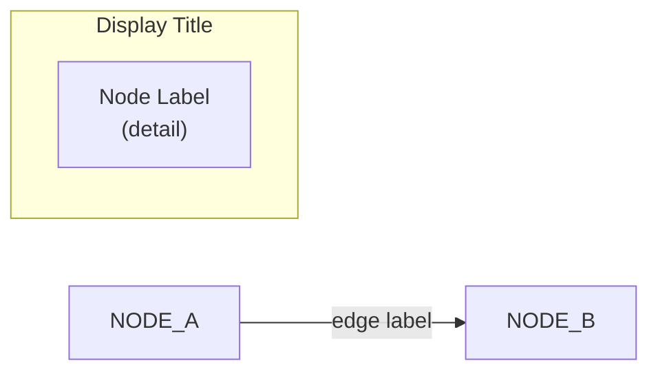

# Architecture Diagram Generator

Generate professional, colored architecture diagrams with icons via a Mermaid → Excalidraw → PNG pipeline.

## Prerequisites

- Node.js 18+ with npm, Puppeteer (`npm install puppeteer`)
- `excalidraw-prototypes/` project directory with pipeline scripts
- Optional: PNG icons in `icons/` sibling directory

## Pipeline

```
.mmd → generate.mjs → .excalidraw → colorize.mjs → -color.excalidraw → export-png.mjs → .png
```

| Step | Script | Input | Output |
|------|--------|-------|--------|
| 1 | `generate.mjs` | `.mmd` (Mermaid) | `.excalidraw` (monochrome) |
| 2 | `colorize*.mjs` | `.excalidraw` | `-color.excalidraw` (styled) |
| 3 | `export-png.mjs` | `-color.excalidraw` | `.png` |

## Workflow

### Step 1: Gather Requirements

Ask the user:
1. What system/architecture to diagram?
2. Main components and their groupings (subgraphs)?
3. Connections/flows between components?
4. Layout: `LR` (horizontal) or `TD` (vertical)?
5. Icons needed? (check `references/icons-manifest.md`)

### Step 2: Write Mermaid Source (.mmd)



**Rules:** Unique node IDs, `\n` for multi-line, `-->|"label"|` for edges, subgraphs can nest.

### Step 3: Configure Colorize Script

Create `colorize-<name>.mjs`. Configure two arrays:

```javascript
const SUBGRAPH_COLORS = [
  { match: (l) => labelContains(l, "keyword"), bg: "#d0ebff", stroke: "#29B5E8" },
];

const NODE_COLORS = [
  { match: (l) => labelContains(l, "keyword"), bg: "#ffffff", stroke: "#29B5E8", icon: "icon.png" },
  // icon: null for nodes without icons
];
```

**Load** `references/colorize-architecture.md` for the full template and phase documentation.

### Step 4: Generate

```bash
cd <project_dir>
node mermaid-to-excalidraw/generate.mjs --input <name>.mmd --output <name>-mermaid.excalidraw
node colorize-<name>.mjs <name>-mermaid.excalidraw <name>-mermaid-color.excalidraw
node export-png.mjs <name>-mermaid-color.excalidraw <name>-mermaid-color.png
```

**IMPORTANT:** `generate.mjs` uses `--input`/`--output` flags, NOT positional args.

Export flags: `--scale N` (default 2), `--max N` (default 1600). Use `--max 2000` or `--scale 4` for high-res.

### Step 5: Verify & Show

Check PNG for overlaps, text truncation, arrow routing. **STOP — show PNG to user for approval.**

### Step 6: Iterate

- Layout changes → edit `.mmd`, re-run from Step 4a
- Color/style → edit colorize script, re-run from Step 4b
- Spacing/overlap → adjust constants in colorize script

## Colorize Phases (ordering matters)

| Phase | Purpose |
|-------|---------|
| PRE-PASS | Normalize `\\n` → real `\n` |
| 0 | Classify rectangles as subgraphs vs nodes |
| 1 | Resize/style nodes (Puppeteer text measurement) |
| 2 | Build parent→children map, resize subgraphs bottom-up |
| 2.5 | Force-directed spacing (SIBLING_GAP=60) |
| 2.6 | Reposition bound text inside moved nodes |
| 2.75 | Wrap subgraph titles (MAX_TITLE_WIDTH=500) |
| 2.76 | Root-level gap enforcement (ROOT_H_GAP=100) — MUST run AFTER 2.75 |
| 2.7 | Create icon images — MUST run AFTER all positioning is final |
| 3 | Recalculate arrow endpoints (boxEdgePoint ray-cast) |
| 4 | Color text labels and arrows |
| Post-4 | Override fontFamily=3 (Helvetica), roughness=0 |

## Snowflake Color Palette

| Name | Hex | Use |
|------|-----|-----|
| SF_BLUE | #29B5E8 | Snowflake primary |
| SF_DARK | #11567F | Dark accents |
| TEAL | #148C8C | Cortex agents, secure data |
| PURPLE | #7048e8 | Intelligence, semantic views |
| GREEN | #2f9e44 | Data foundation, tables |
| ORANGE | #e8590c | Distribution, native apps |
| RED | #e03131 | External sources |

Light variants: LIGHT_BLUE=#d0ebff, LIGHT_TEAL=#c3fae8, LIGHT_PURPLE=#e5dbff, LIGHT_GREEN=#d3f9d8, LIGHT_ORANGE=#fff4e6, LIGHT_RED=#ffe3e3, LIGHT_GRAY=#f1f3f5, SNOW_BG=#e7f5ff

## Troubleshooting

- **Overlapping boxes:** Increase SIBLING_GAP/ROOT_H_GAP; ensure Phase 2.76 runs after 2.75
- **Text overflow titles:** Phase 2.75 wraps; increase MAX_TITLE_WIDTH if needed
- **Icons pixelated:** Use 1024px PNGs. See `references/icon-extraction.md`
- **Text blurry:** Ensure post-Phase 4 sets fontFamily=3; use `--scale 4`
- **`\\n` literal text:** PRE-PASS must normalize before measurement
- **generate.mjs errors:** Uses `--input`/`--output` flags, needs Puppeteer

## References (load on demand)

- `references/colorize-architecture.md` — Full colorize script template with all utility functions
- `references/icons-manifest.md` — Complete icon inventory (78 icons with sizes)
- `references/icon-extraction.md` — How to extract new icons from Snowflake brand PPTX

## Output Files

- `<name>.mmd` — Mermaid source
- `<name>-mermaid.excalidraw` — Raw monochrome
- `<name>-mermaid-color.excalidraw` — Styled (compatible with excalidraw.com / VS Code)
- `<name>-mermaid-color.png` — Final PNG
